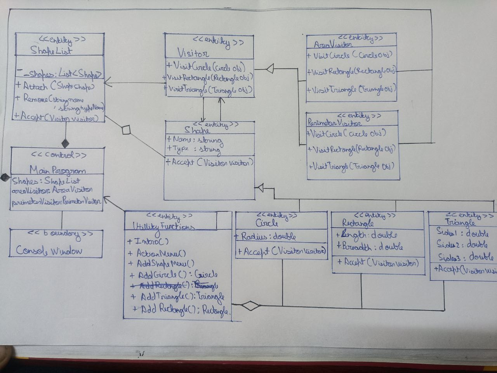

# Overview
**Visitor Pattern** The Visitor design pattern represents an operation to be performed on the elements of an object structure. This pattern lets you define a new operation without changing the classes of the elements on which it operates.
# Design
For demonstration I chose geometric shapes as my Concrete element , and the object structure for operations is a list of shapes , visitors for operations like area and perimeter are made.
**UML Class Diagram**

**UML Action Diagram**

# Environment
The project builds and runs with Visual Studio Community 2022(.NET 6.0) when the required workloads are installed.
